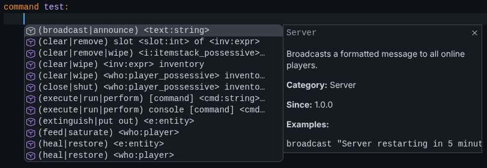
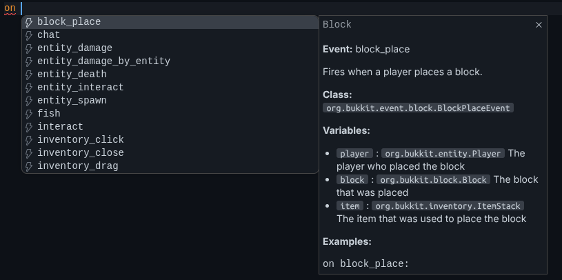
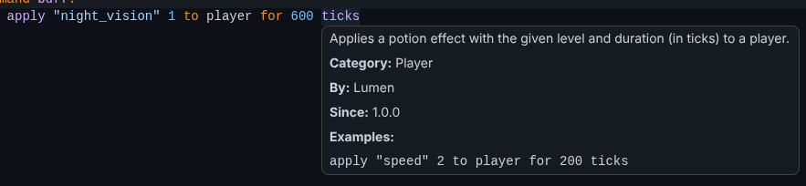
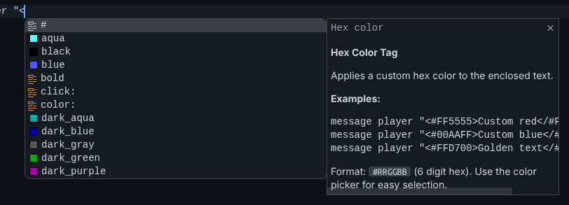
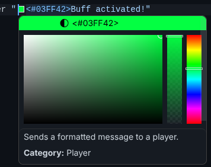

# Lumen LSP

A language server for [Lumen](https://lumenlang.dev), providing editor support for `.luma` scripts.

The official VSCode extension is available at https://github.com/LumenLang/vscode-lumen.

## What is an LSP?

A Language Server Protocol (LSP) server runs in the background and gives your editor features like completions, hover info, error checking, and more. Instead of building these into every editor separately, an LSP works with any editor that supports the protocol. This project is the server. You pair it with a client extension for your editor.

> Most features are implemented, but some may be incomplete, slightly inaccurate, or have minor issues.
> 
> This LSP is designed as a fast, lightweight integration for editors and IDEs. It does not aim to provide fully exact or complete analysis of Lumen scripts, and some behavior may differ from the actual runtime. It is still designed to provide the best possible development experience within these constraints.

## Features

### Completions

Context-aware suggestions that change based on where you are in the script. Events, statements, expressions, variables, blocks, type bindings, and MiniColorize tags are all covered.

*Statements*

*Events*

**There are more completions as well, such as conditions, expressions, and blocks!**

### Hover

Hover over any statement, event, block, or variable to see its documentation. Descriptions, categories, available variables, and examples show up inline.

### Highlighting

Full semantic token support. Keywords, variables, types, events, properties.

### Diagnostics

Errors and warnings from the Lumen pipeline are shown as you type.

### Document Symbols

The outline view lists all blocks, commands, events, data classes, and variable declarations with proper nesting.

### Go to Definition

Jump to where a variable was declared.

### Document Colors

Hex colors inside MiniColorize strings show inline previews with a color picker.

